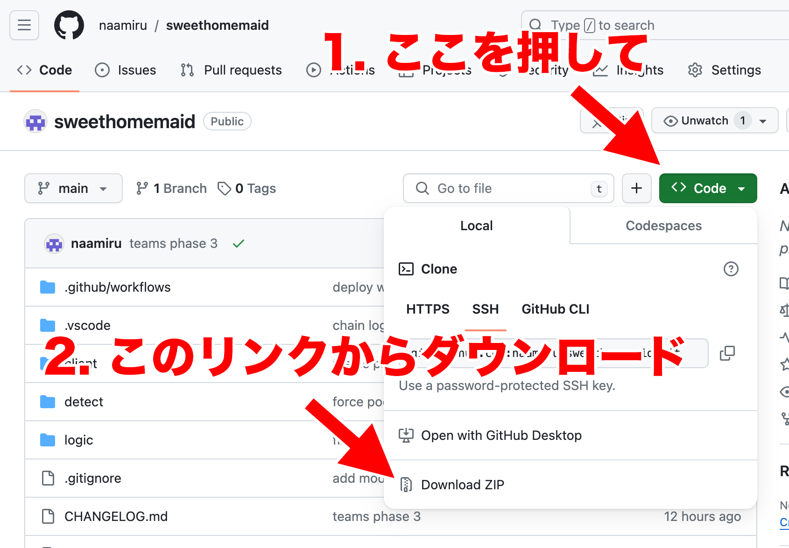

# スイートホームメイド パズルシミュレーター

https://naamiru.github.io/sweethomemaid/

## Chrome 拡張機能を使った盤面読み取り

Chrome 拡張機能を使うとワンクリックでゲーム画面の盤面を読み取ることができます（PC限定）

### 使い方

このプロジェクトのソースコードをダウンロードしてください。

展開した中にある `extension` フォルダを Chrome でパッケージ化されていない拡張機能として読み込んでください。
手順は [パッケージ化されていない拡張機能を読み込む](https://developer.chrome.com/docs/extensions/get-started/tutorial/hello-world?hl=ja#load-unpacked) を参照。

ゲーム画面を別ウィンドウで表示した状態で「画像読取」ボタンを押すと盤面を読み取ります。

おかしくなった時はソースコードを最新にすると直るかもしれません。
